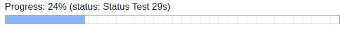

# Queueing Jobs

Run the following using the CakePHP shell:

* Display Help message:

        bin/cake queue

* Try to call the cli add() function on a task:

        bin/cake queue add <TaskName>

  Tasks may or may not provide this functionality.

* Run a queue worker, which will look for a pending task it can execute:

        bin/cake queue run

  The worker will always try to find jobs matching its installed Tasks.


Most tasks will not be triggered from the console, but from the APP code.
You will need to use the model access for QueuedJobs and the `createJob()` method
to do this.

The `createJob()` function takes three arguments.
- The first argument is the name of the type of job that you are creating.
- The second argument is optional, but if set must be an array of data and will be passed as a parameter to the `run()` function of the worker.
- The third argument is options (`'notBefore'`, `'priority'`, `'group'`).

> `priority` is sorted ascending, therefore a task with priority 1 will be executed before a task with priority 5

For sending emails, for example:

```php
// In your controller
$this->loadModel('Queue.QueuedJobs');
$this->QueuedJobs->createJob('Queue.Email', ['to' => 'user@example.org', ...]);

// Somewhere in the model or lib
TableRegistry::getTableLocator()->get('Queue.QueuedJobs')
    ->createJob('Queue.Email', ['to' => 'user@example.org', ...]);
```

It will use the plugin's `EmailTask` to send out emails via CLI.

Important: Do not forget to set your [domain](https://book.cakephp.org/4/en/core-libraries/email.html#sending-emails-from-cli) when sending from CLI.

If you want to disable existence check of tasks when creating jobs, set
`Queue.skipExistenceCheck` to `true`. In this case you will not get a notification
if deprecated or invalid task names are being used.

## Creating using ::class syntax

The default "Cake" way of using magic strings is a convenient way when using the IdeHelper
and having auto-complete this way for each task.

If you use a different IDE or prefer direct `<TaskClassName>::class` syntax to have the IDE
find the usage more easily, you can also use `<TaskClassName>::class` for `createJob()`:

```php
use Queue\Queue\Task\EmailTask;

$this->QueuedJobs->createJob(EmailTask::class, ['to' => 'user@example.org', ...]);
```
This does, however, require adding use statements for each such line on top.

You can also programmatically retrieve a task's name and use that instead:

```php
use Queue\Queue\Task\EmailTask;

$taskName = EmailTask::taskName();

$this->QueuedJobs->createJob($taskName, ['to' => 'user@example.org', ...]);
```
This can be useful when more dynamically adding certain jobs of different types.

## Running only specific tasks per worker
You can filter "running" by group or even type:
```
bin/cake queue run -g MyGroup
bin/cake queue run -t MyType,AnotherType,-ThisOneToo
bin/cake queue run -t "-ThisOneNot"
```
Use `-` prefix to exclude. Note that you might need to use `""` around the value then to avoid it being seen as option key.

That can be helpful when migrating servers and you only want to execute certain ones on the new system or want to test specific servers.

## Avoiding parallel (re)queueing

For some background-tasks you will want to make sure only a single instance of this type is currently run.
In your logic you can check on this using `isQueued()` and a unique reference:
```php
    /**
     * @return \Cake\Http\Response|null
     */
    public function triggerImport() {
        $this->request->allowMethod('post');

        $this->loadModel('Queue.QueuedJobs');
        if ($this->QueuedJobs->isQueued('my-import', 'Queue.Execute')) {
            $this->Flash->error('Job already running');

            return $this->redirect($this->referer(['action' => 'index']));
        }

        $this->QueuedJobs->createJob(
           'Queue.Execute',
            ['command' => 'bin/cake importer run'],
            ['reference' => 'my-import', 'priority' => 2]
        );

        $this->Flash->success('Job triggered, will only take few seconds :)');

        return $this->redirect($this->referer(['action' => 'index']));
    }
```
So if someone clicks on the button again before the job is finished, he will not be able to trigger a new run:
```php
<?= $this->Form->postLink(__('Trigger Import'), ['action' => 'triggerImport'], ['confirm' => 'Sure?']) ?>
```

For more complex use cases, you can manually use `->find()->where()`, of course.

Note that the 2nd argument (job type) is optional, but recommended. If you do not use it, make sure your reference is globally unique.

## Updating progress/status

The `createJob()` method returns the entity. So you can store the ID and at any time ask the queue about the status of this job.

```php
// Within your regular web application
$job = $this->QueuedJobs->createJob(...);
$id = $job->id;
// Store

// Inside your Queue task, if you know the total records:
$totalRecords = count($records);
foreach ($records as $i => $record) {
    $this->processImageRendering($record);
    $this->QueuedJobs->updateProgress($id, ($i + 1) / $totalRecords);
}
```

You can, independently of the progress field, also use a status (string) field to give feedback.
See this example implementation:

```php
class FooTask extends Task {

    public function run(array $data, int $jobId): void {
        // Initializing
        $jobsTable = TableRegistry::getTableLocator()->get('Queue.QueuedJobs');
        $foo = new Foo();

        // Part one
        $jobsTable->updateAll(
            ['status' => 'Doing the first thing'],
            ['id' => $jobId]
        );
        $foo->doFirstPartOfTask();
        $jobsTable->updateProgress($jobId, 33);

        // Part two
        $jobsTable->updateAll(
            ['status' => 'Doing the next thing'],
            ['id' => $jobId]
        );
        $foo->doNextPartOfTask();
        $jobsTable->updateProgress($jobId, 66);

        // Part three
        $jobsTable->updateAll(
            ['status' => 'Doing the last thing'],
            ['id' => $jobId]
        );
        $foo->doLastPartOfTask();
        $jobsTable->updateProgress($jobId, 100);

        // Done
        $jobsTable->updateAll(
            ['status' => 'Done doing things'],
            ['id' => $jobId]
        );
    }
}
```

Get progress status in website and display:
```php
$job = $this->QueuedJobs->get($id);

$progress = $job->progress; // A float from 0 to 1
echo $this->Number->toPercentage($progress, 0, ['multiply' => true]) . '%'; // Outputs 87% for example

$status = $job->status; // A string, make sure to escape
echo h($status); // Outputs "Doing the last thing" for example
```

### Progress Bar
Using Tools plugin 1.9.6+ you can also use the more visual progress bar (or any custom one of yours):

```php
echo $this->QueueProgress->progressBar($queuedJob, 18);
```


The length refers to the amount of chars to display.

Using Tools plugin 1.9.7+ you can even use HTML5 progress bar (easier to style using CSS).
For this it is recommended to add the textual one from above as fallback, though:
```php
$textProgressBar = $this->QueueProgress->progressBar($queuedJob, 18);
echo $this->QueueProgress->htmlProgressBar($queuedJob, $textProgressBar);
```



The text one will only be visible for older browsers that do not support the HTML5 tag.

Make sure you loaded the helper in your AppView class.

By default it first tries to use the actual `progress` stored as value 0...1.
If that field is `null`, it tries to use the statistics of previously finished jobs of the same task
to determine average length and displays the progress based on this.

That also means you should set a high value for `cleanuptimeout` config (weeks/months) to make sure the average
runtime data is available and meaningful.

### Timeout Progress Bar
For those jobs that are created with a run time in the future (`notbefore`), you can also display progress
until they are supposed to be run:

```php
echo $this->QueueProgress->timeoutProgressBar($queuedJob, 18);
```
It shows the progress as current time between `created` and `notbefore` boundaries more visually.

Using Tools plugin 1.9.7+ you can even use HTML5 progress bar (easier to style using CSS).
For this it is recommended to add the textual one from above as fallback, though:
```php
$textTimeoutProgressBar = $this->QueueProgress->timeoutProgressBar($queuedJob, 18);
echo $this->QueueProgress->htmlTimeoutProgressBar($queuedJob, $textTimeoutProgressBar);
```

## Adding jobs from CLI or as click

If you want to also allow adding jobs from CLI, you need to implement the AddInterface:
```php
...
use Queue/Queue/AddInterface;

class MyExampleTask extends Task implements AddInterface {

    ...

    /**
     * @param string|null $data
     *
     * @return void
     */
    public function add(?string $data): void {
        ...
    }

}
```
Now you can add them from both CLI and Web backend (/queue).
So `bin/cake queue add SpecialExample` for SpecialExampleTask.

The payload is a simple string, make sure to quote if it contains whitespace:
```
bin/cake queue add SpecialExample "Foo:Bar, Baz"
```
You need to handle the content of this `$data` string manually inside your `add()` method.

## Using backend actions

You can add buttons to your specific app views to re-run a failed job, or to remove it.
```php
$this->loadHelper('Queue.Queue');
if ($this->Queue->failed($queuedJob)) {
    $query = ['redirect' => $this->request->getAttribute('here')];
    echo $this->Form->postLink(
        'Re-Run job',
        ['prefix' => 'Admin', 'plugin' => 'Queue', 'controller' => 'Queue', 'action' => 'resetJob', $queuedJob->id, '?' => $query],
        ['class' => 'button warning']
    );
    echo ' ';
    echo $this->Form->postLink(
        'Remove job',
        ['prefix' => 'Admin', 'plugin' => 'Queue', 'controller' => 'Queue', 'action' => 'removeJob', $queuedJob->id, '?' => $query],
        ['class' => 'button alert']
    );
}
```
The `redirect` query string element makes sure you are getting redirected back to this page (instead of Queue admin dashboard).

Make sure you allow those actions to be accessed by the user (role) that can trigger this.
Ideally, you also only display those buttons if that user has the access to do so.
[TinyAuth](https://github.com/dereuromark/cakephp-tinyauth) can be used for that, for example.
