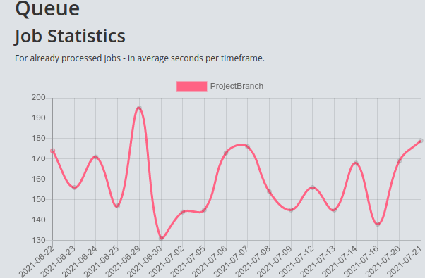

# Statistics

The plugin works completely without it, by just using the CLI shell commands.
But if you want to browse the statistics via URL, you can enable the routing for it (see [Basic Setup](basic_setup.md)) and then access `/admin/queue`
to see how status of your queue, statistics and settings.
Please note that this requires the [Tools plugin](https://github.com/dereuromark/cakephp-tools) to be loaded if you do not customize the view templates on project level.
Also make sure you loaded the helpers needed (Tools.Format, Tools.Time as Time, etc).

By default, the templates should work fine in both Foundation (v5+) and Bootstrap (v3+).
Copy-and-paste to project level for any customization here.

Here an example of historical job data for one specific "ProjectBranch" one:
> 

It can be quite valuable to see the runtime (in seconds) over a progression of time.
